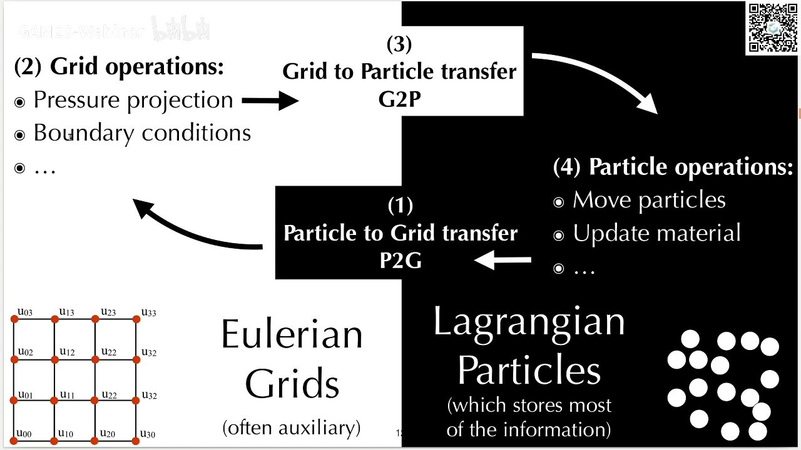
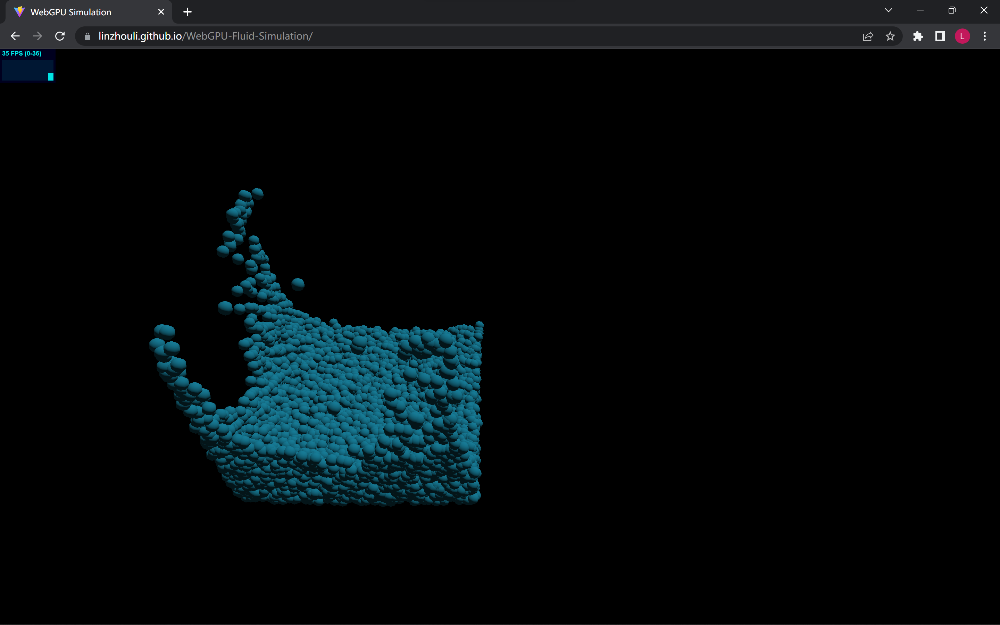

# WebGPU Fluid Simulation

Try: https://linzhouli.github.io/WebGPU-Fluid-Simulation/


## 流体模拟

### 拉格朗日视角

将介质视为**粒子**的集合，粒子会随着介质一起移动，通过计算每个粒子的运动状态和受力情况来表现介质的变化。

优缺点：容易表现介质的运动状态（只需改变粒子的空间位置），但不容易计算受力情况（难以快速搜索到某粒子临近的其他粒子）。

代表方法：SPH (Smoothed Particle Hydrodynamics)，PBD (Position Based Dynamics)

### 欧拉视角

将介质所在的空间划分为**网格**，计算每个网格中介质的运动状态和受力情况。

优缺点：容易计算介质的受力情况（可随机访问空间中某位置的网格信息），难以表现介质的运动状态。

代表方法：FEM有限元

### 混合欧拉-拉格朗日视角

同时在粒子和网格上模拟流体。



代表方法：APIC (Affine Particle in Cell)，MPM (Material Point Method)


## MSL-MPM

参考资料：[A Moving Least Squares Material Point Method with Displacement Discontinuity and Two-Way Rigid Body Coupling | Yuanming Hu (taichi.graphics)](https://yuanming.taichi.graphics/publication/2018-mlsmpm/)

### 符号说明

符号上标表示时间步索引，符号下标表示粒子或网格索引，其中 $i$ 表示网格索引， $p$ 表示粒子索引。

$x$ 表示位置， $\textbf v$ 表示速度， $m$ 表示质量， $V$ 表示体积。

$\Delta x$ 表示网格宽度， $\Delta t$ 表示时间步长。

$\textbf F$ 表示形变梯度， $\textbf C$ 表示速度梯度， $\textbf P$ 为应力（PK1 stress）。

$w$ 为粒子与网格之间插值函数的权重，MPM中使用的是二次B-spline插值函数。

### Particle to Grid

1. 更新形变梯度
   
$$ \textbf F_p^{n+1} = (\textbf I + \Delta t \textbf C_p^n) \textbf F_p^n $$

2. 计算网格动量
   
   $$ (m \textbf v)_i^{n+1} = \sum_p w_{ip} [(m_p \textbf C_p^n - \frac{4\Delta t}{\Delta x^2} V_p^0 \textbf P(\textbf F_p^{n+1}))(x_i - x_p^n) + m_p \textbf v_p] $$

3. 计算网格质量
   
   $$ m_i^{n+1} = \sum_p w_{ip} m_p $$

### Grid Operations

1. 计算网格速度
   
   $$ \textbf v_i^{n+1} = (m\textbf v)_i^{n+1} / m_i^{n+1} $$

2. 施加重力与边界条件

### Grid to Particle

1. 计算粒子速度
   
   $$ \textbf v_p^{n+1} = \sum_i w_{ip} \textbf v_i^{n+1} $$

2. 计算粒子速度梯度
   
   $$ \textbf C_p^{n+1} = \frac {4}{\Delta x^2} \sum_i w_{ip} \textbf v_i^{n+1} (x_i - x_p^n)^T $$

3. 更新粒子位置
   
   $$ x_p^{n+1} = x_p^n + \Delta t \textbf v_p^{n+1} $$


## 具体实现

在WebGPU compute shader中确保计算原子性：

```rust
var old_val: f32; var new_val: f32;
loop {
    let atomic_storage_ptr = &(F_grid_v[i][j][k][0]);
    old_val= bitcast<f32>(atomicLoad(atomic_storage_ptr));
    new_val = old_val + v_del.x;
    if ( 
        atomicCompareExchangeWeak(
        	atomic_storage_ptr, bitcast<i32>(old_val), bitcast<i32>(new_val)
        ).exchanged
    ) { break; }
}
```

首先读取变量的值`old_val`，然后计算变量需要存储的值`new_val`，最后，仅当变量的值依旧为`old_val`时再存储`new_val`，否则不存储此值并重复以上步骤。


## 模拟效果


