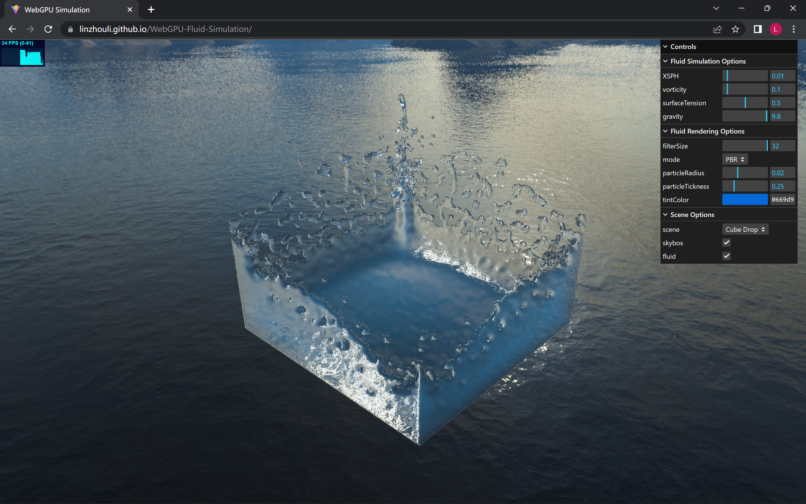
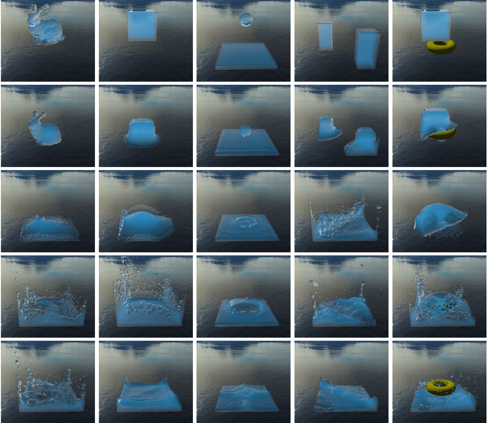

# WebGPU Fluid Simulation

Try: https://linzhouli.github.io/WebGPU-Fluid-Simulation/

Thesis: [LinzhouLi/UndergraduateThesis (github.com)](https://github.com/LinzhouLi/UndergraduateThesis)

## 主要工作

1. 实现了基于位置的流体密度约束解算框架（Position Based Fluid，PBF），保证流体不可压缩性。
2. 实现了隐式边界条件（Volume Map），用于正确补偿流体边界密度采样与流体碰撞检测。
3. 通过添加非压强力改善流体细节，包括表面张力（Surface Tension）、涡量补偿力（Vorticity Confinement）与人工粘性力（XSPH）。
4. 完全并行的高效粒子搜索算法，加速方法为均匀空间网格（Hash Grid），实现算法为并行前缀和（Exclusive Scan）。
5. 实现了流体屏幕空间渲染，深度图平滑使用窄域滤波器（Narrow-Range Filter）。

## 运行界面

## 仿真效果

## 主要参考文献

MACKLIN M, MÜLLER M. Position based fluids[J]. ACM Transactions on Graphics (TOG), 2013, 32(4): 1-12.

KOSCHIER D, BENDER J, SOLENTHALER B, et al. Smoothed particle hydrodynamics techniques for the physics based simulation of fluids and solids[C/OL]//JAKOB W, PUPPO E. Eurographics 2019 - Tutorials. The Eurographics Association, 2019. DOI: 10.2312/egt.20191035.

BENDER J, KUGELSTADT T, WEILER M, et al. Volume maps: An implicit boundary representation for sph[C]//Proceedings of the 12th ACM SIGGRAPH Conference on Motion, Interaction and Games. 2019: 1-10.

AKINCI N, AKINCI G, TESCHNER M. Versatile surface tension and adhesion for sph fluids[J]. ACM Transactions on Graphics (TOG), 2013, 32(6): 1-8.

TRUONG N, YUKSEL C. A narrow-range filter for screen-space fluid rendering[J]. Proceedings of the ACM on Computer Graphics and Interactive Techniques, 2018, 1(1): 1-15.

HARRIS M, SENGUPTA S, OWENS J D. Parallel prefix sum (scan) with cuda[J]. GPU gems, 2007, 3(39): 851-876.
